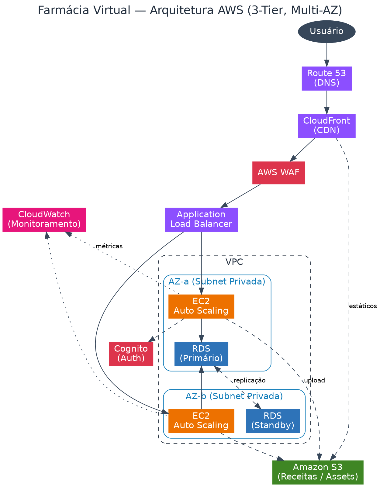

# ☁️ Implementação de Serviços AWS — Redução de Custos

Projeto prático da **DIO — Trilha AWS Cloud**, baseado no desafio de elencar **3 serviços AWS para redução imediata de custos** na empresa fictícia **Abstergo Industries**.

O relatório segue o template oficial da DIO e documenta as ferramentas escolhidas, o foco de cada uma e os casos de uso aplicados.

---

## 🎯 Objetivo

Identificar e justificar **3 serviços AWS** capazes de gerar diminuição de custos imediatos, demonstrando domínio prático sobre otimização financeira em nuvem (FinOps).

---

## 🛠️ Serviços Selecionados

| Etapa | Serviço | Foco | Benefício de Custo |
|-------|---------|------|--------------------|
| 1 | **EC2 Auto Scaling** | Elasticidade computacional | Elimina capacidade ociosa; paga só pelo uso |
| 2 | **S3 Intelligent-Tiering** | Armazenamento otimizado | Move dados frios para camadas mais baratas automaticamente |
| 3 | **Cost Explorer + Budgets** | Monitoramento e controle | Visibilidade de gastos e alertas proativos |

---

## 📄 Relatório

O relatório técnico completo, no formato exigido pela DIO, está em:
👉 [`docs/modelo-relatorio.md`](docs/modelo-relatorio.md)

---

## 🏗️ Diagrama de Apoio



> Diagrama ilustrativo de uma arquitetura AWS onde os serviços de otimização de custo se aplicam.

---

## 📂 Estrutura do Repositório

```
.
├── README.md                  # Este arquivo
├── docs/
│   └── modelo-relatorio.md    # Relatório técnico (template DIO)
└── diagrams/
    ├── arquitetura.png        # Diagrama de apoio
    └── arquitetura.dot        # Fonte editável (Graphviz)
```

---

## 🔗 Links Úteis

- [AWS Cost Optimization](https://aws.amazon.com/aws-cost-management/)
- [Amazon S3 Intelligent-Tiering](https://aws.amazon.com/s3/storage-classes/intelligent-tiering/)
- [AWS Well-Architected — Cost Optimization Pillar](https://docs.aws.amazon.com/wellarchitected/latest/cost-optimization-pillar/welcome.html)
- [DIO — Digital Innovation One](https://www.dio.me/)

---

## 👨‍💻 Autor

**Raphael Herkmann**
🔗 [LinkedIn](https://linkedin.com/in/raphael-herkmann) · [GitHub](https://github.com/faelherkmann)

---

> Desafio desenvolvido na trilha de **Computação em Nuvem AWS** da DIO. ☁️💰
